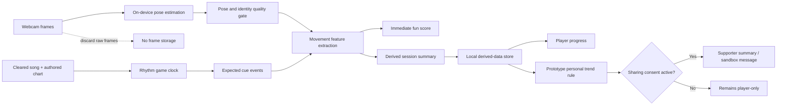

# DanceBros Product Requirements Document

**Working product name:** DanceBros  
**Recommended player-facing name to test:** 舞伴 (Wǔbàn, "Dance Companion")  
**Document status:** Draft v0.1 for product discussion  
**Date:** 26 July 2026  
**Track:** Tencent Cloud "AI Can Do It" Hackathon 2026 - Age Well - Game  
**Target platform:** Laptop-first web game connected to a webcam and optionally displayed on a TV  
**Working submission deadline:** 9 August 2026 for the Singapore event, based on the supplied training deck. Confirm the submission portal because Tencent's public event page shows a broader event window rather than the project cutoff.

---

## 1. Executive summary

DanceBros is a joyful, low-impact rhythm and memory game for older adults. The player follows large on-screen movement cues while a webcam estimates their pose locally. A session begins with simple movement-only play, adds beat timing, and then introduces a short memory or inhibition challenge. The game celebrates the player immediately while quietly deriving movement-and-attention measures from play.

Across repeated, consented sessions, DanceBros builds a personal baseline and shows changes relative to that person's own usual performance. If several high-quality sessions show a sustained change, the product can suggest a friendly check-in to a trusted family member or caregiver whom the player has explicitly chosen.

### One-sentence pitch

> DanceBros turns familiar social dancing into a voluntary stream of movement-and-attention data, helping older adults and trusted family notice sustained changes worth checking without turning play into a clinical test.

### Recommended hackathon proof

Build one polished, repeatable four-minute loop:

1. The player grants camera access and completes a safety calibration.
2. The player learns four low-impact moves.
3. The player dances to a pre-cleared song while cues approach a goal.
4. The game adds one memorable cognitive twist: remember a sequence and freeze on a lantern.
5. Live pose feedback produces an understandable score.
6. A trend screen uses clearly labeled simulated history to show how repeated sessions could reveal a sustained change.
7. A consent-gated caregiver preview shows a gentle "time to check in" message.

This is the minimum complete story. True multi-person tracking, arbitrary-song generation, calibrated gait measurement, and real caregiver messaging should not put it at risk.

---

## 2. Why this product should exist

### 2.1 Problem

China has a large population of older adults at risk of cognitive decline. A national cross-sectional study of 46,011 adults aged 60 and over estimated MCI prevalence at **15.5%**, representing approximately **38.77 million people** at the time of the study.[^mci-study]

Formal assessment is useful, but it only creates data when a person enters a screening or care pathway. DanceBros explores a complementary opportunity: collect consented, repeated measures during an activity that can be enjoyable, social, and familiar.

The initial concept assumes that some active and social older adults may underestimate cognitive risk or avoid screening because of pride, stigma, fear, or a belief that change is normal ageing. These are **research hypotheses, not universal truths about Chinese seniors**. The team must validate them through interviews and avoid portraying older adults as stubborn, unaware, or childlike.

### 2.2 Opportunity

Dance and rhythm play can combine:

- Regular physical activity.
- Attention to visual and audio cues.
- Timing and movement coordination.
- Short-term sequence recall.
- Inhibition when a cue means "do not move."
- A social ritual that can be repeated without clinical framing.

WHO's current dementia risk-reduction guidance supports physical activity, cognitive stimulation, and social engagement as healthy behaviours, including for people with normal cognition or MCI.[^who-guidance] That supports the wellness premise. It does **not** validate DanceBros as a screening or diagnosis method.

### 2.3 Defensible problem statement

Avoid this unsupported claim:

> We detect subtle decline months earlier.

Use this instead:

> Most cognitive assessment happens only after someone decides to seek it. DanceBros adds a voluntary, play-based view of movement and attention between checkups, so a sustained change can lead to an earlier conversation.

The phrase "passive monitoring" must never mean hidden monitoring. In this PRD it means that measures are derived as a by-product of disclosed gameplay, without a separate clinical questionnaire.

---

## 3. Vision, goals, and principles

### 3.1 Product vision

Make maintaining cognitive and physical wellbeing feel like joining a dance, not taking a test.

### 3.2 Hackathon goal

Prove that one webcam, one short rhythm game, and one transparent longitudinal story can create an engaging "Age Well" experience with meaningful AI use and a credible path beyond the demo.

### 3.3 User goals

The older adult should be able to:

- Begin playing without needing technical help.
- Feel successful in the first minute.
- Choose a safe standing or seated experience.
- Understand why the camera is used.
- Know what is and is not stored.
- Enjoy progress without seeing a frightening "brain score."
- Choose whether a trusted person can see trend summaries.
- Revoke sharing or delete data easily.

The trusted family member or caregiver should be able to:

- Understand the person's usual pattern and recent change at a glance.
- See data quality and possible non-health explanations.
- Receive calm, specific suggestions rather than diagnoses.
- Know that a check-in is appropriate and an emergency response is not implied.

### 3.4 Product principles

1. **Joy before measurement.** The game must still be worth playing if the monitoring layer is removed.
2. **Dignity over fear.** Never shame, infantilise, rank health, or use alarming red alerts.
3. **Personal trend over population judgement.** Compare a player with their own valid baseline, not with an age-group leaderboard.
4. **Consent is part of the experience.** Explain measurement and sharing in plain language; make revocation easy.
5. **Separate fun scores from wellness trends.** A bad game score should not imply poor health.
6. **Explain uncertainty.** Low light, pain, fatigue, unfamiliar songs, and camera placement can affect performance.
7. **Safety beats feature count.** Slow, bounded movements and a seated path are more important than impressive choreography.
8. **Make AI visible and honest.** Show where AI perceives pose or creates assets, and where ordinary rules or statistics are used.
9. **Build the demo backwards.** Every must-have feature must strengthen the live story or a judging criterion.

---

## 4. Scope decisions

### 4.1 Recommended MVP

The MVP is:

- Browser-first.
- One primary tracked player.
- One pre-authored, rights-cleared song.
- Standing and seated movement variants.
- Three increasingly demanding rounds.
- On-device pose estimation.
- Immediate game scoring.
- Local session summaries.
- Simulated longitudinal history, clearly labeled as simulated.
- A consent-gated caregiver trend and notification preview.
- A Miora-generated visual system implemented in the game.
- A documented CodeBuddy-assisted build and testing trail.

### 4.2 Explicit trade-offs

| Idea | MVP decision | Reason |
|---|---|---|
| True multi-person scoring | Defer | Occlusion and identity swaps can corrupt scoring and personal trends. Some candidate SDK paths are also single-body. |
| Social dancing | Include as companion mode | Friends can dance alongside the primary player, but only the calibrated player is scored and profiled. |
| Any song | Defer to stretch | Beat-map generation, choreography safety, latency, file handling, and music rights add too much risk. |
| Pre-cleared song | Include | Gives the team a reliable, rehearsable demo with authored cues. |
| Gait speed | Exclude from MVP | A fixed monocular webcam does not provide reliable real-world distance without calibration and validation. |
| Movement speed and timing | Include | These can be measured as game-relative values without pretending they are clinical gait measures. |
| TUG-style assessment | Research roadmap | A separate, calibrated task may be studied later; it should not be hidden inside the dance game. |
| Real caregiver alert | Include | |
| "Cognitive profile" label | Include | Use "movement-and-attention trend" or "rhythm snapshot" to avoid implying a clinical assessment. |

---

## 5. Users and jobs

### 5.1 Primary persona: active older adult

**Example:** Mei, 68, enjoys community dance and uses a smartphone but prefers large, direct interfaces.

**Job:** "Give me a fun, safe activity I can do regularly without making me feel tested."

**Needs:**

- A fast route into play.
- Clear demonstrations rather than text-heavy instructions.
- Encouragement without exaggerated praise.
- Music and visual themes that feel adult and culturally familiar.
- Control over camera and family sharing.

### 5.2 Secondary persona: trusted supporter

**Example:** Jun, 39, Mei's son, lives separately and wants useful signals without spying.

**Job:** "Help me know when a friendly check-in may be worthwhile without making me interpret medical data."

**Needs:**

- A short trend summary.
- The reasons for a change flag.
- Data-quality context.
- Respectful suggested language.
- No access unless Mei has approved it.

### 5.3 Tertiary persona: community facilitator

**Example:** Lin, 57, leads a neighbourhood plaza-dance group.

**Job:** "Start a safe group activity quickly and keep participants engaged."

In the MVP, the facilitator can help position the camera and select seated or standing mode. Group administration is out of scope.

### 5.4 Future stakeholder: health or research professional

A clinician or researcher may help validate tasks and interpretation. They are not a user of the hackathon MVP and do not receive alerts.

---

## 6. UX decision brief

- **Job:** Complete a safe, enjoyable rhythm session and leave with a clear sense of progress.
- **User mode:** First-time and returning older adult; occasional supporter reviewing trends.
- **Frequency/risk:** Three to five short sessions per week; health-adjacent, camera, and sensitive-data risk.
- **Pattern:** Guided setup with skip/resume for the first run; direct "Play today's dance" entry for returning users; monitoring dashboard with priority and drill-down for supporters.
- **Primary action:** Play today's dance.
- **Secondary actions:** Change movement mode, review progress, manage sharing, adjust language or sound.
- **Core path:** Home -> camera and safety check -> learn -> dance -> memory twist -> result -> return later.
- **Recovery path:** Explain and recover from denied permission, missing body, low light, occlusion, lost audio, interruption, or invalid session without blaming the player.
- **Required states:** Empty, loading, partial history, permission blocked, tracking lost, invalid session, success, insufficient baseline, simulated trend, consent revoked.
- **Handoff constraints:** One primary action per screen; large controls; voice plus text; shape plus colour; no hidden health score; no frightening medical language; no raw-frame storage.

---

## 7. Core experience

### 7.1 Information architecture

**Player surfaces**

- Today
- Play
- My Rhythm
- Privacy and Sharing
- Help and Safety

**Supporter surfaces**

- Shared People
- Recent Pattern
- Check-in Suggestion
- Sharing Status

The hackathon build can implement these as four lightweight routes without authentication. A demo-role switch may be used, but it must be visibly marked "Demo."

### 7.2 First-time flow

1. **Welcome**
   - Product promise: "Move, remember, enjoy."
   - Primary action: "Try a 4-minute dance."
   - Plain-language note: "Your camera helps the game follow your movement. Video stays on this device."

2. **Consent**
   - Explain the camera, derived movement measures, local history, and optional sharing separately.
   - Camera processing consent is required for scoring.
   - Caregiver sharing is optional and off by default.
   - Do not bundle research consent into product consent.

3. **Choose movement mode**
   - Standing candidate set: side steps, front toe taps, small back toe taps, reaches, holds.
   - Seated: alternating foot taps, knee lifts, arm reaches, torso turns within a safe range.
   - Lock only four scored moves after the day-one pose spike. If front/back depth is unreliable, replace those cues with arm reach and hold rather than shipping inconsistent scoring.

4. **Safety and space check**
   - Ask the player to clear the floor, use supportive shoes, and keep a stable chair nearby in standing mode.
   - Show a large "Pause" action throughout play.
   - Tell the player to stop if they feel pain, dizziness, or unsteadiness.

5. **Camera calibration**
   - Mirror preview.
   - Whole-body or seated-body outline.
   - Simple instructions: move back, brighten room, keep one primary player in the frame.
   - Confirm stable tracking for three seconds.

6. **Move tutorial**
   - Demonstrate one move at a time.
   - Require two comfortable successful repetitions, not perfect form.
   - Allow replay, slower demonstration, or switch to seated mode.

7. **Start**
   - Give a short countdown and a visible beat pulse.

### 7.3 Returning-player flow

The first screen shows:

- "Play today's dance" as the only primary action.
- Selected mode and approximate duration.
- A small progress statement such as "3 dances this week."
- No trend warning on the home screen.

Camera calibration is shortened but never skipped entirely. A returning player should begin the first cue in under 45 seconds.

### 7.4 Four-minute game loop

#### Phase 0: Warm-up and quality check - 30 seconds

- Slow alternating side steps or seated taps.
- Establish tracking quality and comfortable range.
- Do not contribute to the fun score or trend measures.

#### Phase 1: Follow the guide - 60 seconds

- A Miora-created guide demonstrates the four moves locked after the pose spike.
- Large lane icons approach a target in time with the music.
- Measures basic directional accuracy, movement initiation, and comfortable amplitude.
- The player receives immediate "Good," "Nearly," or "Try the next one" feedback.

#### Phase 2: Move to the beat - 75 seconds

- Cues combine into short patterns.
- Timing windows remain forgiving.
- The game adjusts one step up or down based on recent success.
- Measures timing consistency, left-right correctness, and error recovery.

#### Phase 3: Lantern memory twist - 75 seconds

- The guide teaches a two- to four-move sequence.
- Some cue icons fade before reaching the target.
- A lantern icon means "hold still" for one beat.
- Measures sequence recall and false movement on a no-go cue without presenting a clinical test.

#### Phase 4: Cool-down and result - 30 seconds

- Slow breathing and small reaches.
- Show a celebratory fun score and one concrete achievement.
- Ask an optional context question: "Anything different today?" with choices such as tired, sore, distracted, camera issue, or no.
- A context response can exclude the session from trend analysis without discarding the player's game result.

### 7.5 Fun scoring

The visible game score rewards participation:

- **Beat:** reached the movement within the cue window.
- **Shape:** moved in the expected direction and approximate range.
- **Flow:** recovered and continued after a miss.
- **Memory bonus:** completed a learned sequence.

The result should say:

> Great flow - you stayed with 18 of 22 beats and recovered quickly after two tricky lanterns.

It should never say:

> Your cognitive score is low.

### 7.6 Progress surface

Before enough valid sessions exist:

> We are learning your usual rhythm. Complete 3 more dances to see a personal pattern.

After a baseline exists:

- Weekly participation.
- Rhythm consistency.
- Sequence accuracy.
- A plain-language status: "Close to your usual pattern," "Not enough clear data," or "A recent change is worth noticing."
- Data quality and excluded-session count.

Avoid a single composite "brain health" number.

### 7.7 Supporter flow

1. The player opens Privacy and Sharing.
2. The player chooses "Invite someone I trust."
3. The product explains exactly what the supporter can see.
4. The player confirms separate sharing consent.
5. The supporter sees summary trends only, never camera footage.
6. If a demo trend condition is met, the supporter sees:

> Mei's timing and sequence recall were outside her usual range in 2 of the last 3 clear sessions. This can happen for many reasons, including tiredness or discomfort. Consider a friendly check-in. DanceBros does not diagnose a health condition.

7. Suggested action: "Send a check-in" with editable copy.
8. Secondary action: "Why am I seeing this?"
9. The player can revoke access at any time.

The hackathon version should preview this flow in a sandbox and must not send a real message without an explicit later decision.

---

## 8. Required states and recovery

| State | Player experience | Recovery |
|---|---|---|
| Camera permission not requested | Explain purpose before the browser prompt | "Enable camera" |
| Camera permission denied | Calm message; game remains navigable | Browser-specific instructions and "Try again" |
| Camera unavailable | Explain that another app may be using it | Close other app, retry, or enter spectator demo |
| No body found | Show framing outline and one instruction at a time | Move back, improve light, or choose seated mode |
| More than one body found | Mark the calibrated primary player and warn that only one player is scored | Ask companions to stand behind the boundary |
| Low landmark confidence | Pause scoring without pausing music immediately | Reposition; resume after stable tracking |
| Tracking lost mid-song | Preserve the fun flow for a short grace period | Resume; mark affected segment invalid for trends |
| Low light or strong backlight | Show a non-technical prompt | Turn on a light or face away from window |
| Audio failed or delayed | Stop before scored cues begin | Reload audio or run silent tutorial |
| Session interrupted | Save no partial trend score | Resume from the start of the current round |
| Session technically invalid | Keep celebration and participation credit | Explain that the session will not affect the personal pattern |
| No history | Explain baseline creation | Show number of valid sessions remaining |
| Partial history | Show participation but no trend conclusion | Invite another session later |
| Context confounder reported | Retain game score, exclude from trend | Explain exclusion in history |
| Sharing not enabled | No supporter data | Invite only from player's privacy screen |
| Sharing revoked | Supporter sees access-ended state | No re-enable without a new player action |
| Simulated history active | Persistent "Simulated demo data" badge | Return to real local history |

---

## 9. Measurement model

### 9.1 Claim boundary

The webcam produces **gameplay measures**, not validated digital biomarkers. Any mapping to attention, memory, balance, or coordination is a research hypothesis until studied against accepted assessments in the intended population.

### 9.2 Derived gameplay measures

| Game event | Derived measure | Hypothesised domain | Boundary |
|---|---|---|---|
| Directional cue | Correct limb/direction rate | Visuomotor attention and coordination | Can also reflect hearing, vision, pain, instruction clarity, or tracking error |
| Beat cue | Median absolute timing error and variability | Processing and motor timing | Not clinical reaction time |
| Repeated movement | Range consistency | Movement consistency | Not strength or range-of-motion diagnosis |
| Hold cue | Torso displacement in camera-relative coordinates | Postural stability proxy | Not centre of mass, force-plate sway, or fall risk |
| Learned sequence | Correct ordered moves | Short-term sequence recall | Not a validated memory test |
| Lantern no-go cue | False movement rate | Response inhibition | Not a Stroop or clinical executive-function score |
| Missed cue | Beats required to rejoin | Error recovery and adaptation | Influenced by music familiarity and motivation |
| Left/right pattern | Side-specific accuracy difference | Coordination asymmetry proxy | Not neurological lateralisation |

### 9.3 Pose quality gate

A metric may enter a session summary only when:

- The required landmarks are visible.
- Per-landmark confidence exceeds the selected model threshold.
- The player remains inside the calibrated area.
- The relevant cue is not within a tracking-loss grace window.
- No identity swap is detected.
- The move is appropriate for the selected standing or seated mode.

A session is "trend-valid" only when:

- Calibration succeeded.
- At least 80% of scored cue frames passed the quality gate.
- The player completed all three scored phases.
- No major audio-clock failure occurred.
- The player did not mark the session as affected by pain, illness, unusual fatigue, or a camera problem.

The 80% threshold is an engineering starting point, not a medical standard.

### 9.4 Personal baseline

For the hackathon demonstration:

- The first five valid sessions form a provisional baseline.
- The dashboard uses median and median absolute deviation for robustness.
- Metrics are compared only at the same or normalised difficulty.
- A direction-adjusted standardised deviation is calculated per metric family.
- A demo trend flag requires an unfavourable shift in at least two metric families in at least two of the last three valid sessions.
- A flag is suppressed when data quality is low or a confounder was reported.
- The interface labels the algorithm "Prototype trend rule - not clinically validated."

These rules make the demo explainable. They are not production thresholds and must not be tuned to create a desired health conclusion.

### 9.5 Production research direction

Before a real alerting feature:

1. Determine test-retest reliability under normal variation.
2. Quantify camera, device, clothing, lighting, and room effects.
3. Study learning effects from repeating the same patterns.
4. Validate standing and seated tasks separately.
5. Compare measures with clinician-selected reference assessments.
6. Measure false-positive and false-negative consequences.
7. Pre-register thresholds or modelling plans.
8. Conduct ethics, privacy, accessibility, and regulatory review.
9. Validate across age, sex, region, language, mobility, and assistive-device groups.

Do not expose diagnostic sensitivity, specificity, or clinical cutoffs until a properly designed study supports them.

---

## 10. Adaptive difficulty

The MVP should use an explainable bounded rule:

- Start at a slow tempo and two-move patterns.
- After eight of the last ten cues are successful, add one pattern step or fade one cue.
- After three misses in five cues, restore the full cue or slow the next pattern.
- Never increase both tempo and memory load at the same time.
- Cap standing tempo and movement range at a safety-reviewed maximum.
- A manual "Make it gentler" action is always available.

This rule is personalization, but it should not be misrepresented as machine learning. A later adaptive model may be explored only if it is more reliable and understandable than the rule.

---

## 11. Functional requirements

### 11.1 Must-have for submission

| ID | Requirement | Acceptance condition |
|---|---|---|
| FR-01 | Camera disclosure and consent | No camera prompt appears before a plain-language explanation; play cannot start without explicit action |
| FR-02 | Standing and seated selection | The selected mode changes tutorial, cue set, calibration, and scoring |
| FR-03 | Safety check | The player confirms clear space and can pause at all times |
| FR-04 | Pose calibration | The game gives actionable framing feedback and confirms stable tracking |
| FR-05 | Single-player pose scoring | The locked four-move set passes the team's confusion test at demo speed; front/back toe taps ship only if the day-one depth test passes |
| FR-06 | Three-round game | Follow, rhythm, and memory/no-go phases work end to end |
| FR-07 | Forgiving real-time feedback | Feedback appears without interrupting play and does not punish uncertain frames |
| FR-08 | Fun result | The player sees beat, shape, flow, and memory achievements with no medical conclusion |
| FR-09 | Session quality classification | Every session is stored as valid, invalid, or excluded with a reason |
| FR-10 | Local history | Derived session summaries persist locally across reloads; raw frames do not |
| FR-11 | Baseline state | Progress clearly distinguishes insufficient history from a personal baseline |
| FR-12 | Simulated trend demo | Seeded history is visibly labeled and can be reset without affecting real local history |
| FR-13 | Supporter preview | A consent state, trend explanation, and non-alarming message are demonstrable |
| FR-14 | Privacy controls | Player can view stored fields, delete local history, and revoke sharing |
| FR-15 | Miora visuals | Generated assets appear in the playable loop, not only in the deck |
| FR-16 | AI provenance | The team can show prompts, iterations, chosen assets, CodeBuddy usage, tests, and runtime-AI boundaries |
| FR-17 | Demo fallback | A prerecorded pose trace or keyboard-controlled spectator demo can show the loop if venue camera conditions fail; it is labeled |
| FR-18 | Simplified Chinese support | Core instructions, safety copy, cues, and results are available in Simplified Chinese |

### 11.2 Should-have

- Voice guidance with captions and volume control.
- Deterministic adaptive difficulty.
- English language toggle for judges.
- A companion boundary so another person can dance without being scored.
- Editable check-in message preview.
- A weekly participation view.
- An "Anything different today?" context prompt.
- Low-light and multi-body guidance.
- On-device event replay for debugging using synthetic landmark traces, not saved video.

### 11.3 Stretch

- Local-only song import with automatic beat-map draft.
- Human review of generated move charts before play.
- Two-player party scoring with persistent profiles disabled.
- Dialect-specific audio prompts.
- Real cloud sync and supporter authentication.
- WeChat or SMS integration in a sandbox.
- More Miora environments and seasonal dance journeys.

### 11.4 Won't-have in this hackathon

- Open-ended user-generated choreography.
- Distribution of commercial music.
- Multiplayer health trends.
- TUG or clinical gait assessment.
- Production anomaly thresholds.
- Real health alerts.
- Clinician dashboard.

---

## 12. "Any song" mode

The long-term idea is attractive, but it must be staged.

### 12.1 MVP

- Ship one rights-cleared or original song.
- Author one deterministic beat map by hand.
- Store cue timestamps and safe moves in a versioned chart file.
- Rehearse the exact chart used in the demo.

### 12.2 Stretch workflow

1. The player chooses a local audio file.
2. The file is decoded locally and is not uploaded by default.
3. Beat and section analysis produces a draft timing grid.
4. A safety-constrained chart generator selects only allowed moves for the chosen mode.
5. A preview checks cue density, repeated side loading, tempo, and recovery gaps.
6. The player confirms the chart before dancing.

### 12.3 Constraints

- Do not claim that any song can be safely choreographed without review.
- Do not distribute copyrighted audio with the game.
- Do not store uploaded audio in the cloud in the MVP.
- A song change alters timing and familiarity; longitudinal comparison should use matched or normalised content.
- Songs with unstable tempo, long silence, or extreme BPM should be rejected or simplified.

---

## 13. Multi-person strategy

### 13.1 MVP: companion mode

- One calibrated primary player is scored.
- Other people may dance outside the scoring boundary.
- If another body overlaps the primary player, trend scoring pauses for that segment.
- The UI celebrates social participation but does not assign the companion a score.

### 13.2 Future: party mode

Two or more players may receive:

- Separate fun scores.
- Group synchrony moments.
- Team streaks and cooperative goals.

No multi-person session should affect a personal wellness trend until identity persistence, occlusion recovery, fairness, and test-retest reliability are validated.

---

## 14. Visual and content direction

### 14.1 Recommended direction

**"Community square at golden dusk"**

- Warm evening light.
- Paper-cut or woodblock-inspired accents used with restraint.
- High-contrast lane markers.
- A friendly adult dance guide rather than a mascot that treats seniors like children.
- Lanterns as the no-go/memory symbol.
- Subtle festival energy without visual clutter.

Plaza dance and traditional motifs are promising hypotheses, not requirements for every older Chinese user. Test urban, regional, and contemporary alternatives.

### 14.2 Miora asset brief

Use Miora to create a coherent, implemented asset family:

- Primary dance-guide character with standing and seated poses.
- Community-square background in three depth layers.
- Left, right, front, back, reach, and hold cue icons.
- Lantern memory/no-go icon.
- Calibration silhouette and framing illustrations.
- Success effects and gentle recovery effects.
- Three progress illustrations.
- Supporter check-in illustration.
- Key art and demo-video frames.

For every asset, retain:

- Prompt.
- Model/tool version if shown.
- Source image or reference rights.
- Generated variants.
- Human edits.
- Export date and format.
- Final in-product location.

### 14.3 Accessibility

- Minimum 24 px body text at the target viewing distance; larger for cues.
- Large controls with generous spacing.
- High contrast.
- Shape, label, position, and audio reinforce colour.
- No information conveyed only by red or green.
- No rapid flashing.
- Captions for spoken instructions.
- Volume and reduced-motion controls.
- Calm error copy with one next action.
- Adult, plain Simplified Chinese.

---

## 15. AI strategy and judging proof

The official preliminary rubric weights **Use of AI Tools at 40 points**, above Impact and Relevance at 30 and Project Quality at 30. AI must therefore be visible in the product and in the creation story.

### 15.1 AI layers

| Layer | Role | MVP status | Honest claim |
|---|---|---|---|
| Runtime pose model | Estimate body landmarks from webcam frames | Must-have | AI perception enables touch-free play |
| Movement classifier | Convert landmark sequences into game events | Must-have | May be geometric/rule-based after AI pose estimation |
| Difficulty adaptation | Adjust cue support within safe bounds | Must-have rule | Explainable personalization, not necessarily AI |
| Trend rule | Identify repeated deviations from personal baseline | Demo only | Statistical prototype, not diagnosis |
| Song-to-chart generation | Draft beat timing and safe move sequence | Stretch | AI-assisted content generation if actually implemented |
| Miora | Generate coherent visual assets and iterations | Must-have | AI-assisted visual production |
| CodeBuddy | Assist implementation, debugging, tests, and documentation | Must-have process | AI-assisted development with human review |

### 15.2 AI evidence pack

The deck and demo should show:

- A live pose overlay before it becomes the game character.
- One cue being classified from landmarks.
- The quality gate refusing to score an uncertain frame.
- A Miora prompt-to-variant-to-final-asset progression.
- The same Miora asset in the live game.
- A CodeBuddy example that led to tested code, not just generated boilerplate.
- A small system card naming model limitations and fallback behaviour.
- A clear boundary between AI, deterministic game rules, and simulated data.

### 15.3 Do not overclaim

Avoid calling every calculation AI. Judges are more likely to trust a precise explanation:

> AI estimates the pose. Transparent rules turn pose into game events. A robust statistical prototype summarises change. Miora and CodeBuddy accelerate the build.

---

## 16. Candidate technical architecture

This section is directional, not an implementation commitment.

### 16.1 Web client

Candidate components:

- TypeScript web application.
- Canvas or lightweight game renderer.
- Web Audio clock for deterministic cue timing.
- Browser camera API.
- Browser-compatible pose model.
- Web Worker where supported to keep inference off the main UI thread.
- IndexedDB for local derived summaries.
- Synthetic pose traces for deterministic tests and venue fallback.

### 16.2 Pose-provider decision gate

The supplied research recommends Tencent Effect SDK. Tencent's official body-keypoint documentation confirms 3D keypoint output and Unity use on supported SDK paths, but the documented payload currently describes a single body item.[^tencent-pose]

Within the first development day, prove:

- The chosen target platform supports the SDK or model.
- Required body landmarks are available.
- Demo-device inference is at least 20 effective frames per second.
- Input-to-feedback latency is below 180 ms at the 95th percentile.
- Standing and seated calibration both work.
- Licensing permits the hackathon demo.

If Tencent Effect cannot support the browser target in time, use a proven browser pose model. The official Game track still requires CodeBuddy and Miora; do not block the entire demo on an optional SDK integration.

### 16.3 Timing

- Schedule cues against one monotonic audio clock.
- Timestamp pose frames.
- Estimate and subtract known pipeline delay.
- Do not use render-frame arrival time as the beat timestamp.
- Log frame rate, dropped frames, and cue timing for debugging.

### 16.4 Optional backend

The hackathon proof does not require a production backend. If cloud sync is added:

- Use pseudonymous player IDs.
- Store only derived metrics and consent records.
- Encrypt in transit and at rest.
- Separate supporter relationships from session data.
- Use role-based access.
- Maintain an audit log for sharing changes.
- Keep simulated demo data in a separate namespace.

### 16.5 Proposed logical data model

**Player**

- `player_id`
- `display_name`
- `language`
- `movement_mode`
- `created_at`

**ConsentRecord**

- `consent_id`
- `player_id`
- `purpose`
- `version`
- `granted_at`
- `revoked_at`

**Session**

- `session_id`
- `player_id`
- `chart_version`
- `movement_mode`
- `difficulty_band`
- `started_at`
- `completed_at`
- `quality_status`
- `exclusion_reason`
- `self_report_context`

**SessionMetric**

- `session_id`
- `metric_name`
- `value`
- `unit`
- `valid_frame_ratio`
- `model_version`
- `algorithm_version`

**TrendEvent**

- `trend_event_id`
- `player_id`
- `rule_version`
- `metric_families`
- `window_start`
- `window_end`
- `status`
- `simulated`

**SupporterGrant**

- `grant_id`
- `player_id`
- `supporter_id`
- `scope`
- `granted_at`
- `revoked_at`

Raw image or video fields are intentionally absent.

---

## 17. Privacy, consent, and medical-safety requirements

Pose and health-related information can be sensitive personal information. China's Personal Information Protection Law identifies biometric and medical-health data as sensitive and requires a specific purpose, necessity, strict protection, and separate consent for processing sensitive personal information.[^pipl]

### 17.1 Privacy requirements

- Process raw frames on-device.
- Do not retain screenshots, video, face crops, or audio recordings.
- Store the minimum derived data needed for the disclosed purpose.
- Explain data fields in plain language.
- Make supporter sharing separate and optional.
- Make withdrawal as easy as granting consent.
- Delete local history immediately when requested.
- Never sell, advertise against, or rank users with wellness data.
- Keep demo/simulated data clearly separated.
- Require legal review before a public pilot or cross-border data transfer.

### 17.2 Product-claim requirements

- Use "wellness pattern," "movement-and-attention trend," and "check-in."
- Do not use "detected MCI," "cognitive decline confirmed," "risk score," or "early diagnosis."
- Always say a change can have many causes.
- Provide a neutral suggestion to seek qualified advice if the player or family is concerned.
- Do not specify clinical urgency from game data.

### 17.3 Physical safety requirements

- Standing and seated choice appears before play.
- No jumping.
- No full backward travel.
- Back cues use a small toe tap and return.
- No fast spins.
- No one-leg balance requirement.
- Movement range is bounded and previewed.
- A pause control remains visible.
- Tracking failure never causes the game to demand a larger movement.
- The game reminds players to stop for pain, dizziness, or unsteadiness.
- The prototype is tested with the selected movement set before older-adult sessions.

---

## 18. Non-functional requirements

### 18.1 Performance

- At least 20 effective pose inferences per second on the demo laptop.
- 30 frames per second visual rendering target.
- Under 180 ms p95 motion-to-feedback latency on the demo device.
- Audio and cue drift under 50 ms across a four-minute session.
- Calibration completes within 30 seconds in supported conditions.
- No more than one full-page load after play begins.

### 18.2 Reliability

- Five consecutive end-to-end demo runs without refresh.
- Reconnect camera after permission or device interruption.
- No trend update from an invalid or incomplete session.
- Seeded demo history can be restored deterministically.
- Spectator fallback works offline.

### 18.3 Compatibility

- Latest Chrome on the exact submission/demo laptop.
- 1280x720 minimum viewport.
- Built-in or USB webcam.
- Full-screen display suitable for laptop or TV mirroring.

Broader browser support is post-hackathon.

### 18.4 Observability

Local debug mode should show:

- Inference rate.
- Render rate.
- Audio clock offset.
- Landmark confidence.
- Quality-gate state.
- Current cue and detected action.
- Session validity.
- Model and algorithm versions.

Debug data must not include saved raw frames.

---

## 19. Success metrics

### 19.1 Hackathon proof metrics

- 5/5 consecutive demo runs complete successfully.
- At least 90% of authored cues are scoreable in the controlled demo setup.
- A first-time tester reaches the first successful move within 90 seconds.
- A tester can explain the product in one sentence after the demo.
- Judges can identify all three AI layers: pose perception, Miora creation, CodeBuddy-assisted development.
- The trend screen and caregiver message are understood as non-diagnostic.
- No raw video leaves the device.

### 19.2 Early usability metrics

For a small, consented, non-clinical test:

- Session completion rate.
- Time to calibration.
- Permission-denial rate.
- Tutorial replay rate.
- Self-reported enjoyment.
- Perceived safety.
- Comprehension of monitoring and sharing consent.
- Willingness to play three times per week.
- Supporter comprehension and alarm level.

### 19.3 Future product metrics

- Valid sessions per active player per week.
- Four-week retention.
- Percentage of sessions excluded for quality or context.
- Sharing opt-in and revocation rates.
- Check-in suggestion helpfulness.
- Unnecessary-alarm rate.
- Device and environment failure rate.
- Test-retest reliability per measure.

Clinical sensitivity or specificity is not a product KPI until a validated study exists.

---

## 20. Validation plan

### 20.1 Technical spike

Test:

- Bright and dim rooms.
- Backlighting.
- Plain and patterned clothing.
- Seated and standing modes.
- Small and large movement ranges.
- Temporary occlusion.
- A companion entering the frame.
- Low-end and demo laptops.
- Audio output through laptop and TV.

### 20.2 Usability study

If safe recruitment is possible, conduct a small formative study with approximately 5-8 older adults and 3-5 supporters. This is not a clinical study.

Observe:

- Whether consent is understood.
- Whether setup requires help.
- Which moves feel safe.
- Whether the visuals feel respectful.
- Whether the memory twist is enjoyable or frustrating.
- Whether "usual pattern" and "check-in" language is understood.
- Whether a caregiver message feels supportive or intrusive.

Do not recruit older adults merely to produce a testimonial. Obtain informed consent, avoid collecting unnecessary health information, and allow withdrawal.

### 20.3 Expert review

Before external health claims, seek:

- Geriatric or neurology input on claim boundaries.
- Physiotherapy input on movement safety.
- Clinical neuropsychology input on task interpretation.
- Privacy and regulatory advice.
- Older-adult accessibility review.

---

## 21. Risks and mitigations

| Risk | Likelihood / impact | Mitigation |
|---|---|---|
| Medical overclaim | High / critical | Non-diagnostic language, simulated-data label, claim review, no clinical thresholds |
| Hidden-surveillance perception | Medium / critical | Upfront disclosure, on-device frames, separate sharing consent, easy deletion |
| False caregiver alarm | Medium / high | Multi-session rule, quality gate, context exclusions, calm copy, sandbox only |
| Falls or discomfort | Medium / critical | Seated mode, bounded moves, no jumps/spins, safety check, pause |
| Pose failure in venue | Medium / high | Controlled camera setup, debug overlay, synthetic fallback, rehearsed lighting |
| Multi-person identity swap | High / high | One primary player, companion boundary, pause affected trend scoring |
| Any-song rights issue | High / high | Cleared track only; local import as stretch; no distribution |
| Beat timing drift | Medium / high | Monotonic audio clock, timestamped frames, automated timing test |
| Senior stereotypes | Medium / high | User research, adult visual language, multiple style hypotheses |
| Data breach | Low in local MVP / critical | No raw media, minimal fields, local-first, no unnecessary backend |
| Tencent SDK or licence delay | Medium / high | Day-one spike and browser-model fallback |
| Miora output inconsistency | Medium / medium | Style bible, asset shortlist, human compositing, export test early |
| Too many features | High / high | Freeze the four-minute proof loop before stretch work |
| Learning effect mistaken for improvement | High / high | Version charts, compare matched content, research before real trends |
| Pain, fatigue, medication, or mood confounds | High / high | Optional context prompt, exclusions, explain uncertainty |

---

## 22. Hackathon judging alignment

The supplied official guideline sets:

- Impact and Relevance: 30 points.
- Use of AI Tools: 40 points.
- Project Quality: 30 points.
- Social-media reach bonus: up to 5 points.

### 22.1 Impact and Relevance - 30

Evidence:

- Direct fit with "Age Well": independence, dignity, social activity, and cognitive wellbeing.
- A large, evidenced problem without relying on fear.
- Player-controlled family involvement.
- Standing and seated inclusion.
- A realistic research and safety boundary.

### 22.2 Use of AI Tools - 40

Evidence:

- Live pose estimation drives gameplay.
- Miora-generated assets are visible throughout the game.
- CodeBuddy is used for implementation, debugging, and testing.
- Optional song-to-chart generation if it is genuinely completed.
- AI provenance and limitations are shown, not hidden.

### 22.3 Project Quality - 30

Evidence:

- Complete four-minute interactive loop.
- Reliable camera calibration and recovery states.
- Consistent art direction.
- Clear audio-visual feedback.
- Seated accessibility.
- Longitudinal concept demonstrated with an honest simulated-data badge.
- Rehearsed live and fallback demos.

### 22.4 Bonus

If the team publishes publicly, use the exact campaign hashtags required by the supplied guideline and recheck the current portal wording before posting. Do not publish participant footage or health-adjacent data without separate consent.

---

## 23. Demo storyboard

### Three-minute judge version

**0:00-0:20 - Human problem**

> Mei dances with friends every week. Like many active older adults, she has no reason to seek a cognitive test. Her family has no useful signal between everyday life and a formal assessment.

Show the national MCI prevalence estimate once, without sensationalising it.

**0:20-0:35 - Product**

> DanceBros makes the activity itself useful. It is a rhythm and memory game that turns disclosed webcam pose data into a personal movement-and-attention pattern.

**0:35-1:35 - Live wow moment**

- Calibrate.
- Perform left, right, front, and hold cues.
- Let a cue fade.
- Deliberately move on one lantern to show the no-go mechanic.
- Show that the game ignores a low-confidence frame.

**1:35-2:05 - Immediate value**

- Show the fun score.
- Show the session-quality label.
- Open "My Rhythm."

**2:05-2:30 - Longitudinal story**

- Enable the clearly marked simulated history.
- Show two metric families outside the usual range over multiple sessions.
- Open the explanation.

**2:30-2:45 - Consent and supporter**

- Show that sharing is off by default.
- Preview the non-alarming check-in message.

**2:45-3:00 - Why this is AI-native**

- Pose model perceives movement.
- Miora created the visual world.
- CodeBuddy accelerated and tested the build.
- End with the claim boundary and future validation path.

### Demo fallback

If live camera conditions fail:

- State that fallback mode is active.
- Replay a recorded landmark trace, not a deceptive prerecorded "live" video.
- Keep the classifier, scoring, trend, and UI live.
- Offer to show the real camera debug view after the main story.

---

## 24. Delivery plan to 9 August

Assumes work begins 26 July and the Singapore deadline in the supplied deck is correct.

| Date | Outcome |
|---|---|
| 26-27 Jul | Freeze PRD, prove browser pose stack, verify Miora exports and music rights, lock four moves |
| 28-30 Jul | Camera calibration, audio clock, authored chart, single-player scoring |
| 31 Jul-1 Aug | Three-round game, standing/seated variants, session-quality gate |
| 2-3 Aug | Local history, simulated trend, supporter consent preview |
| 4-5 Aug | Miora asset integration, Simplified Chinese copy, accessibility pass |
| 6 Aug | Failure states, synthetic fallback, performance and timing tests |
| 7 Aug | Five-run demo rehearsal, user test, fix only demo blockers |
| 8 Aug | Record demo video, finish introduction deck, package provenance |
| 9 Aug | Submit web link, demo video, and project introduction deck; retain a verification copy |

The official deliverables in the supplied guideline are:

- Game web link.
- Game demo video showing core gameplay and AI.
- Project introduction deck covering project overview, AI creation, team information, and related details.

### Scope freeze

After 3 August, no true multi-person, arbitrary-song, cloud notification, or clinical task work enters the submission branch unless every must-have acceptance condition already passes.

---

## 25. Launch and submission checklist

### Product

- [ ] Player can complete the four-minute loop.
- [ ] Standing and seated paths both work.
- [ ] No medical diagnosis language appears.
- [ ] Sharing is off by default.
- [ ] Simulated history is labeled on every relevant screen.
- [ ] Raw frames are neither stored nor transmitted.
- [ ] Permission, tracking-loss, invalid-session, and no-baseline states work.

### Technical

- [ ] Demo laptop and webcam are frozen and tested.
- [ ] Five consecutive live runs pass.
- [ ] Audio and cue timing are measured.
- [ ] Offline fallback is tested.
- [ ] Production build has no secrets or debug participant data.
- [ ] Web link is reachable in an unsigned-out browser.

### AI evidence

- [ ] CodeBuddy contribution examples are documented.
- [ ] Miora prompts, variants, and final assets are documented.
- [ ] Runtime pose model and limitations are documented.
- [ ] Deterministic and simulated components are labeled honestly.

### Submission

- [ ] Web link.
- [ ] Demo video.
- [ ] Project introduction deck.
- [ ] Team information.
- [ ] AI-creation description.
- [ ] Rights-cleared music and asset review.
- [ ] Current deadline and social hashtag wording reconfirmed.

---

## 26. Open decisions for the team

These are the highest-value questions to resolve before implementation:

1. **Audience:** Are we designing first for active adults aged roughly 60-75, or for a broader range including significant mobility limitations?
   1. To make it simpler, go with adults aged 60 - 75. Doesnt need to be active.
2. **Name:** Keep DanceBros publicly, or test a warmer bilingual name such as 舞伴?
   1. Go with 舞伴
3. **Demo surface:** Laptop only, or laptop mirrored to a TV?
   1. Our video demo for now is laptop, but can be mirrored to TV in the future.
4. **Movement mode:** Can the team commit to both standing and seated choreography in the MVP?
   1. For MVP: Do standing, since thats the main selling point of the app. But i think a seated version where the they play along with hand and finger gesture should be built in too.
5. **Music:** Do we have an original or clearly licensed track now?
   1. No. You pick a publicly-available track that fits the theme of this proejct - old chinese music that can be danced to.
6. **Tencent access:** Do we already have functioning CodeBuddy and Miora accounts, credits, and export rights?
   1. Yes. Non-issue. You generate the code and assets as needed.
7. **Pose stack:** Is a Tencent runtime SDK important to the team, or is the requirement satisfied by CodeBuddy and Miora while a browser pose model powers play?
   1. Do use Tencent runtime SDK if needed.
8. **Supporter demo:** Should it remain an in-app preview, or is a sandbox WeChat message strategically important?
   1. WeChat support would be good for this hackathon. Do include a guide on how to implement that for my own testing on my end once you are done building the project.
9.  **User research:** Can we safely recruit older adults and supporters for formative testing before 6 August?
    1.  Yes. Non-issue
10. **Pitch stance:** Are we comfortable dropping "detect months earlier" and "cognitive profile" in favour of a more defensible longitudinal-wellness claim?
    1.  Yes, as long as it helps us win the hackathon.

## 27. Source and evidence notes

The supplied July 20 training deck is the source of truth used here for track requirements, deliverables, scoring weights, and the working Singapore deadline. Tencent's public hackathon page confirms the 2026 "Age Well" Social Good Challenge but currently displays an overall event window rather than the submission cutoff.[^hackathon]

The supplied long-form research report was used as a directional idea bank. Its medical, cultural, product, and Tencent-service claims should not be treated as verified merely because they carry citations. This PRD relies on official or primary sources for material claims and marks unvalidated ideas as hypotheses.

[^mci-study]: Jia L, et al. "Prevalence, risk factors, and management of dementia and mild cognitive impairment in adults aged 60 years or older in China: a cross-sectional study." *The Lancet Public Health* (2020). [PubMed](https://pubmed.ncbi.nlm.nih.gov/33271079/)
[^who-guidance]: World Health Organization. "New WHO guidelines: up to 45% of dementia risk could be prevented or delayed" (15 July 2026). [WHO](https://www.who.int/news/item/15-07-2026-new-who-guidelines--up-to-45--of-dementia-risk-could-be-prevented-or-delayed)
[^tencent-pose]: Tencent Cloud. "Tencent Effect SDK - Body Keypoints - Android." The documentation describes 3D body output, Unity use, and a payload whose `items` array currently contains one element. [Tencent Cloud documentation](https://www.tencentcloud.com/document/product/1143/53584)
[^pipl]: Standing Committee of the National People's Congress. "Personal Information Protection Law of the People's Republic of China." See Articles 14, 28, 29, and 30 on informed consent and sensitive personal information. [Official text](https://www.npc.gov.cn/WZWSREL25wYy9jMi9jMzA4MzQvMjAyMTA4L3QyMDIxMDgyMF8zMTMwODguaHRtbD9yZWY9aW1i)
[^hackathon]: Tencent Cloud Hackathon. The official site lists the 2026 "Age Well" Social Good Challenge Singapore. [Official event site](https://tch.tencentcloud.com/)
