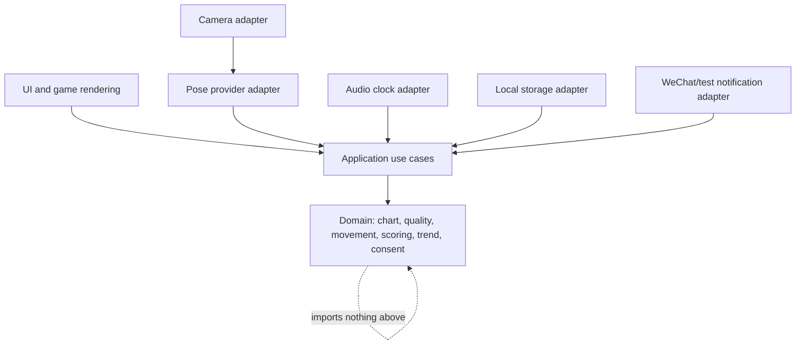

# Architecture

**Status:** Binding target architecture  
**Owner:** Engineering lead  
**Reference when:** Creating modules or changing a cross-layer flow.  
**Agent obligation:** Keep dependencies inward and external technologies
replaceable.

## Architectural shape

舞伴 uses a modular monolith in one browser application. It applies
functional-core/imperative-shell and hexagonal boundaries without creating
separate deployable services.

## Domain modules

- `chart` - versioned cue timing and safe-move validation.
- `movement` - provider-neutral landmarks/events and classification.
- `quality` - frame and session validity.
- `scoring` - fun score.
- `trend` - baseline and prototype deviation rule.
- `consent` - purposes, scopes, grants, and revocation.
- `session` - lifecycle and immutable completion summary.

## Application use cases

Examples: calibrate player, run session, complete session, load progress, grant
supporter access, evaluate trend, send check-in. Use cases coordinate ports and
domain decisions but do not contain SDK-specific parsing.

## Ports and adapters

Ports are allowed for:

- pose frames;
- monotonic clock/audio;
- local session persistence;
- IDs and time;
- notification delivery;
- optional remote sync.

Provider payloads are translated at the adapter boundary. The application
cannot import Tencent, MediaPipe, IndexedDB, WeChat, or browser media types.

## Boundaries

- Raw frames stop at the pose adapter.
- Audio clock is the only cue-time authority.
- Session completion is atomic from the domain's perspective.
- Simulation enters through fixtures/adapters with a visible metadata flag.
- Notification transport receives an already-authorised, already-rendered
  check-in command and cannot decide recipients or medical meaning.

## Scalability

Scale by measurement:

- move inference off the UI thread when profiling shows contention;
- batch derived metrics rather than frames;
- add remote sync behind the existing store port;
- split deployable services only after independent scaling, security, or
  ownership requirements exist.

A diagram does not authorise a module. A module exists only for current
behavior.
