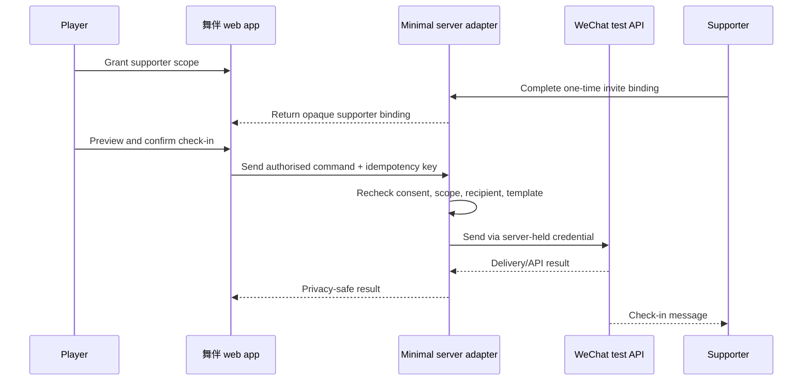

# WeChat caregiver check-in integration

**Status:** Local port and unavailable adapter implemented; exact channel and
API remain gated  
**Owner:** Integration lead  
**Reference when:** Selecting or implementing the owner-test caregiver message
path.  
**Agent obligation:** Re-verify current official WeChat platform rules and API
documentation at implementation time; keep all credentials server-side.

## Product boundary

This integration sends a non-diagnostic check-in to a player-approved
supporter. It does not send emergency, clinical, or unsolicited marketing
messages.

## Current implementation boundary

The local application implements the grant/revoke model, check-in preview,
stable command ID, duplicate suppression, privacy-safe audit outcome, and a
notification port. The active adapter returns `unavailable` and performs no
network call. This is intentional until the project owner selects a current
WeChat test surface and provides private server-side configuration. It is not
delivery evidence.

## Channel decision

Before code, choose one owner-controlled test surface:

- Official Account test/sandbox message capability;
- Mini Program subscription message capability;
- another current WeChat developer test mechanism.

Evaluate current account eligibility, recipient opt-in/follow/subscribe rules,
template restrictions, send windows, domain requirements, and sandbox
availability in the official WeChat developer portal. Platform capabilities and
policies change; do not implement from an old blog post.

## Architecture



## Implementation steps

1. Project owner creates/selects the WeChat test application and confirms
   message capability.
2. Record App ID as configuration; keep App Secret in server secret storage.
3. Create an approved message template with neutral check-in copy.
4. Implement one-time supporter invite/binding. The web client stores only an
   opaque binding ID, not a raw platform secret.
5. Implement short-lived platform-token retrieval/cache on the server according
   to current official rules.
6. Implement `sendCheckIn` behind the application notification port.
7. Recheck active grant immediately before send.
8. Use a stable trend/check-in event ID for idempotency and suppress duplicates.
9. Store privacy-safe attempt/result codes without message body.
10. Implement revoke and verify that future sends fail closed.

## Required environment names

Names may be refined after channel selection:

```text
WECHAT_APP_ID
WECHAT_APP_SECRET
WECHAT_MESSAGE_TEMPLATE_ID
WECHAT_API_BASE_URL
WECHAT_TEST_MODE
```

No secret-prefixed value is exposed through client-build environment variables.

## Test matrix

- Active consent + correct recipient -> one message.
- Revoked consent -> no provider call.
- Duplicate command -> one provider send/result reuse.
- Expired provider token -> one safe refresh and retry.
- Invalid/blocked recipient -> visible failure, no recipient substitution.
- Provider timeout -> bounded retry only if idempotent.
- Simulated trend -> message states demo/simulation or sending is disabled,
  according to the approved demo policy.
- Missing server config -> play still works; send reports unavailable.

## Owner test guide

When implementation exists, append exact dated portal steps, screenshots,
verified official documentation links, test account identifiers in a private
runbook, commands, and received-message evidence. Do not commit App Secret,
access tokens, OpenIDs, QR binding tokens, or personal screenshots.

Production rollout requires a separate security, privacy, account-policy, and
operations decision.
